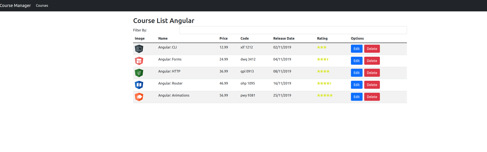

# Course Manage

Introdução ao Angular com [Angular CLI](https://github.com/angular/angular-cli) versão 13.3.0.

Neste curso foi demonstrado os conceitos e técnicas necessárias para começar a desenvolver aplicações usando Angular.

Mentoria de Wesllhey Holanda [https://github.com/wesllhey](https://github.com/wesllhey)

---

